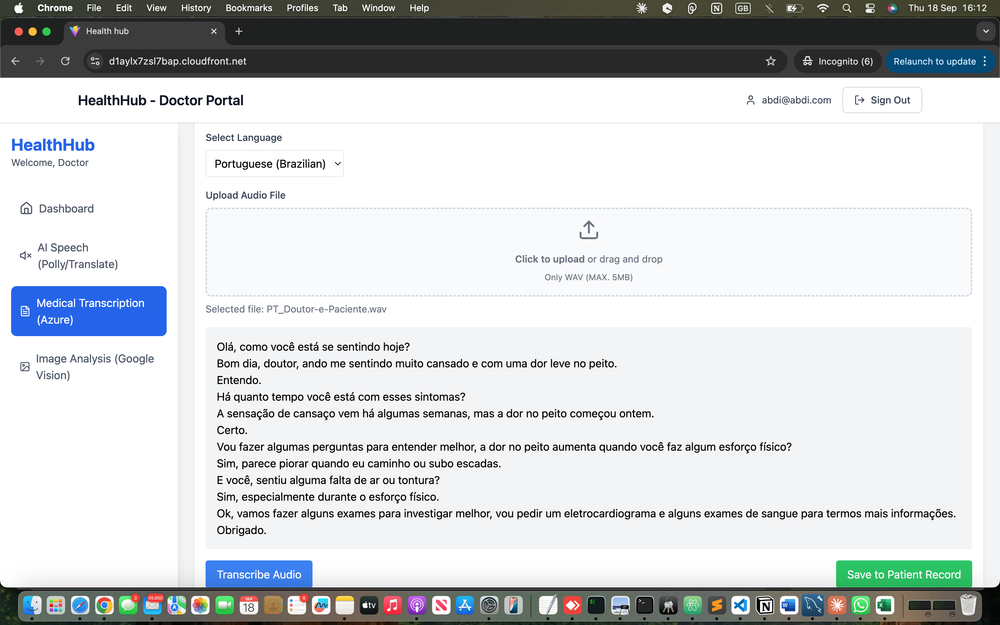
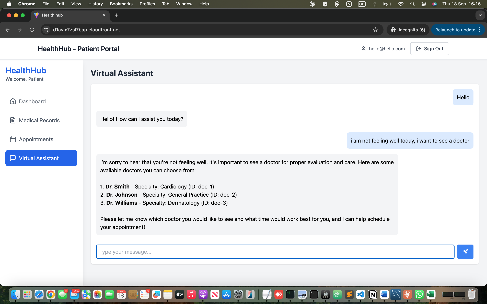
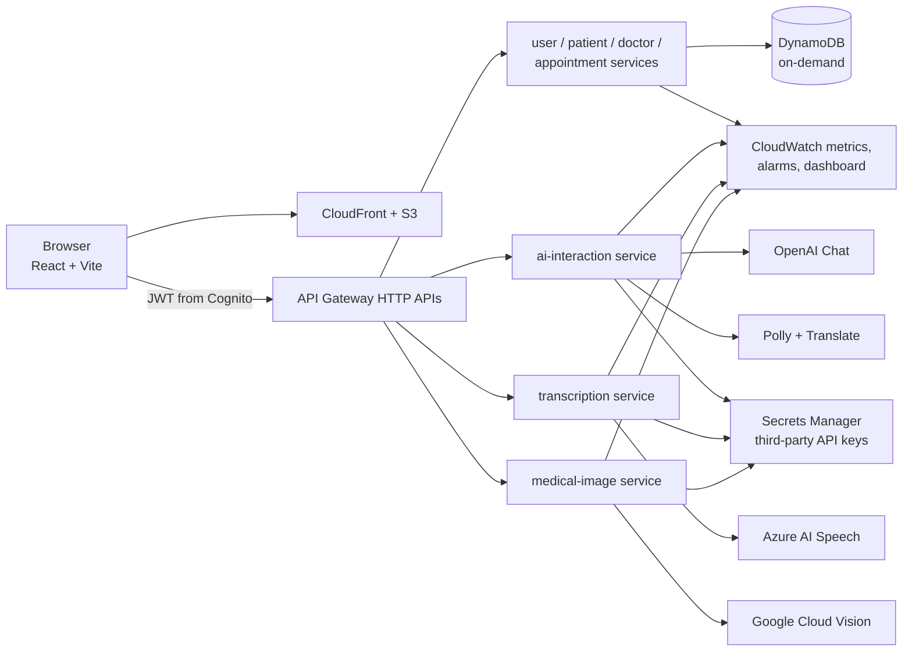

# HealthHub: Serverless Multi-Cloud AI Prototype

A serverless healthcare *demo* on AWS that combines three external AI services:

- **Azure AI Speech** for transcribing doctor–patient audio
- **OpenAI** for a patient virtual assistant
- **Google Cloud Vision** for image labelling

It also uses **Amazon Polly/Translate** for multilingual speech. There are 7 Lambda microservices behind HTTP APIs, DynamoDB, Cognito, and a React front end on S3 + CloudFront, provisioned with Serverless Framework and Terraform.

> **Portfolio prototype, sample data only.** I built and ran this in my own AWS account in September 2025, then tore it down. It was never used by real patients or a client, and it is **not** HIPAA or NHS compliant. See section 4 for what would need to change before it could handle real health data.

| Medical transcription (Azure AI Speech) | Virtual assistant (OpenAI) |
|---|---|
|  |  |

---

## 1. Problem

Small clinics want AI features (transcription, triage chat, multilingual output) but don't want to run GPU infrastructure or pick a single AI vendor. This prototype explores how far a **pay-per-request serverless backend** can go when it orchestrates managed AI APIs from three clouds, and what that costs in complexity: secrets, latency, failure modes.

## 2. Architecture


```mermaid
flowchart LR
  U[Browser<br/>React + Vite] --> CF[CloudFront + S3]
  U -->|JWT from Cognito| API[API Gateway HTTP APIs]
  API --> L1[user / patient / doctor /<br/>appointment services]
  API --> L2[ai-interaction service]
  API --> L3[transcription service]
  API --> L4[medical-image service]
  L1 --> DDB[(DynamoDB<br/>on-demand)]
  L2 --> OAI[OpenAI Chat]
  L2 --> PT[Polly + Translate]
  L3 --> AZ[Azure AI Speech]
  L4 --> GV[Google Cloud Vision]
  L2 & L3 & L4 --> SM[Secrets Manager<br/>third-party API keys]
  L1 & L2 & L3 & L4 --> CW[CloudWatch metrics,<br/>alarms, dashboard]
```

| Area | Where |
|---|---|
| 7 services (Serverless Framework, TypeScript, webpack) | `health-hub-backend/src/services/*`, `serverless-compose.yml` |
| Front end | `health-hub-frontend/` |
| Terraform: S3/DynamoDB state bootstrap, CloudFront, WAF, DynamoDB autoscaling, alarms, secrets | `infrastructure/terraform/` |
| CI/CD (GitHub Actions) | `.github/workflows/` (CI → build → deploy dev / staging / prod) |
| Runbook | `docs/TROUBLESHOOTING.md` |

## 3. Key decisions and trade-offs

- **Serverless over containers.** At prototype traffic, Lambda + DynamoDB on-demand costs cents and needs no capacity planning. The trade-offs are cold starts on the AI paths and a 29-second API Gateway timeout, which rules out long transcriptions without an async (S3 + queue) pattern.
- **Best-of-breed AI per task, not one vendor.** I used Azure for speech, OpenAI for chat and Google for vision. The flexibility costs three sets of credentials, three failure modes, and cross-cloud latency.
- **Third-party keys in Secrets Manager, cached in the Lambda.** No API keys in code or env files. Caching avoids a Secrets Manager call per request.
- **One Serverless service per domain.** Services deploy independently via `serverless-compose`. The trade-off is duplicated boilerplate (utils, webpack configs) across services.
- **Custom CloudWatch metrics for the AI calls.** OpenAI latency, token counts and estimated cost per call are published as metrics, because the AI APIs are where cost and latency actually live.

## 4. Known limitations / what I'd do next

This is a prototype, and the gaps below are exactly why:

- **APIs have no authorizer.** The HTTP API routes (users, patients, images) are not protected by a Cognito JWT authorizer, and registration lets the caller choose their own role, including `doctor`. **This is the first thing to fix:** JWT authorizer on every route, role derived from Cognito groups, not the request body.
- **IAM is `Resource: "*"`** in the service roles, CORS is `*`, and the Cognito password policy is 6 characters. All three need tightening to table ARNs, the app origin, and a real password policy.
- **Some AI paths are templated.** The main image path sends images to Google Vision's generic label detection, which is **not** a medical model. Other image and assistant paths return templated demo text, now labelled as such.
- **No compliance work was done.** Real patient data would need a BAA/DPA with every AI provider, data residency decisions, audit logging, encryption with customer-managed keys, and a DPIA. That is a project in itself.
- **CI uses long-lived AWS keys** (and the test job uses the prod keys). Next: GitHub OIDC with per-environment roles.
- **The staging job runs `terraform destroy` on failure.** It's convenient for a demo, but dangerous as a pattern.
- **Code duplication.** There are parallel `.js`/`.ts` utilities and several `serverless*.yml` variants per service.

## 5. Evidence

- Screenshots from the deployed app (Sept 2025) are in `screenshots/`:
  - Azure transcription of a Portuguese doctor–patient recording
  - OpenAI assistant suggesting doctors and booking an appointment
  - Doctor portal
- Working third-party integrations in code:
  - OpenAI chat: `ai-interaction-service/src/services/aiInteractionService.ts`
  - Azure Speech REST: `transcription-service/transcription.js`, `simple-transcription.js`
  - Google Vision `images:annotate`: `medical-image-service/src/services/medicalImageService.ts`
- API spec: `health-hub-backend/src/services/user-service/docs/api-spec.yaml`

## 6. Run it yourself

Prerequisites: Node 18, AWS account, Serverless Framework, Terraform ≥ 1.5, and API keys for OpenAI, Azure Speech and Google Vision stored in Secrets Manager (see `infrastructure/terraform/modules/secrets`).

```bash
# Infrastructure (state backend first)
cd infrastructure/terraform/bootstrap && terraform init && terraform apply
cd .. && terraform init -backend-config="bucket=<your-state-bucket>" && terraform apply

# Backend services
cd ../../health-hub-backend && npm install
npx @serverless/compose deploy --stage dev

# Front end
cd ../health-hub-frontend && npm install && npm run dev
```

**Cost:** near zero when idle (Lambda, DynamoDB on-demand, S3). CloudFront, WAF and CloudWatch alarms add a few dollars a month. The real variable cost is the AI APIs, roughly $0.001–0.01 per assistant or transcription call at demo volumes. Tear down with `npx @serverless/compose remove --stage dev` and `terraform destroy`.

---

**Abdihakim Said**, AWS Solutions Architect · CKA. I build serverless and AI-integrated platforms on AWS, and I'm upfront about what it takes to make them production-ready. Contact details are on my [GitHub profile](https://github.com/abdihakim-said).
